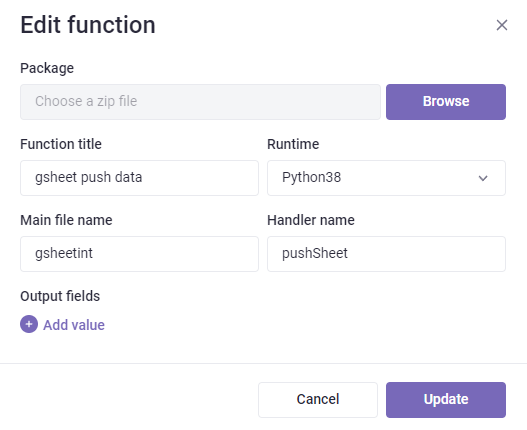
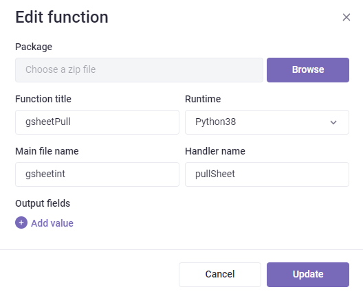

# Gridly Google Sheets integration

# **Create a Google Cloud project** 
A Google Cloud project is required to use Google Workspace APIs and build Google Workspace add-ons or apps. This project forms the basis for creating, enabling, and using all Google Cloud services, including managing APIs, enabling billing, adding and removing collaborators, and managing permissions.

To create a Google Cloud project:

1. Open the [Google Cloud Console](https://console.cloud.google.com/).
1. At the top-left, click Menu **menu** > **IAM & Admin** > **Create a Project**.
1. In the **Project Name** field, enter a descriptive name for your project.
   Optional: To edit the **Project ID**, click **Edit**. The project ID can't be changed after the project is created, so choose an ID that meets your needs for the lifetime of the project.
1. In the **Location** field, click **Browse** to display potential locations for your project. Then, click **Select**. **Caution: Can't find your Google Workspace organization?**
   This means you aren't signed in to a Google Workspace account. Some of the features described in Google Workspace developer documentation are only available to projects associated with an organization.
1. Click **Create**. The console navigates to the Dashboard page and your project is created within a few minutes.

For further information on Google Cloud projects, refer to [Creating and managing projects](https://cloud.google.com/resource-manager/docs/creating-managing-projects).

### **Create service account credentials**
A service account is a special kind of account used by an application, rather than a person. You can use a service account to access data or perform actions by the robot account itself, or to access data on behalf of Google Workspace or Cloud Identity users. For more details, refer to [Understanding service accounts](https://cloud.google.com/iam/docs/understanding-service-accounts).
# **Create a service account**
1. Open the [Google Cloud Console](https://console.cloud.google.com/).
1. At the top-left, click Menu **menu** > **IAM & Admin** > **Service Accounts**.
1. Click **Create service account**.
1. Fill in the service account details, then click **Create and continue**. Note: By default, Google creates a unique service account ID. If you would like to change the ID, modify the ID in the service account ID field.
1. Optional: Assign roles to your service account to grant access to your Google Cloud project's resources. For more details, refer to [Granting, changing, and revoking access to resources](https://cloud.google.com/iam/docs/granting-changing-revoking-access).
1. Click **Continue**.
1. Optional: Enter users or groups that can manage and perform actions with this service account. For more details, refer to [Managing service account impersonation](https://cloud.google.com/iam/docs/impersonating-service-accounts).
1. Click **Done**.
## Create credentials for a service account
You must obtain credentials in the form of a public/private key pair. These credentials are used by your code to authorize service account actions within your app.

To obtain credentials for your service account:

1. Open the [Google Cloud Console](https://console.cloud.google.com/).
1. At the top-left, click Menu **menu > IAM & Admin > Service Accounts.**
1. Select your service account.
1. Click **Keys** > **Add keys** > **Create new key**.
1. Select **JSON**, then click **Create**.
   Your new public/private key pair is generated and downloaded to your machine as a new file. This file is the only copy of this key. For information about how to store your key securely, see [Managing service account keys](https://cloud.google.com/iam/docs/understanding-service-accounts#managing_service_account_keys).
1. Click **Close**.


# Share the folder that contains your files
Share the folder with the e-mail address you received for your service user.
# Prepare your lambda zip
1. Download or clone the files from git
2. Install the required dependecies with pip by using the following command:   
```
	pip install -r requirements.txt -t . --no-user
```

# Add the generated JSON to your lambda zip
Rename The JSON you downloaded from google API to “cred.json” and add it to the folder with the python files.

# Configure the payload of your lambda
```
	{

		"gridlyApiKey":"yourGridlyAPIKEY",

		"spreadSheetName":"theNameOfTheSpreadsheetYouWantToImport",

		"viewId":"${view.id}",

		"synchColumns":"true",

		"sheetUniqueIdColumn":0

	}
```

## gridlyApiKey
You must set your gridly API key for the value of this item, because the data imported through the API.
## spreadSheetName
You must set the name of the sheet you would like to connect to your Grid.
## viewId
This is a placeholder in the payload, you don’t have to change it’s value.
## synchColumns
You can set “synchColumns” “true” and “false”, if you have set to true, the script will create the columns from your spreadsheet, and delete the columns that aren’t in your spreadsheet. If it is set as “false”, the script won’t touch the columns.
## sheetUniqueIdColumn
Here you can define the index of the unique ID column of your spreadsheet.
# Setup your lambda to pull data into Gridly from a google sheet


# Setup your lambda to push data from Gridly into a google sheet

